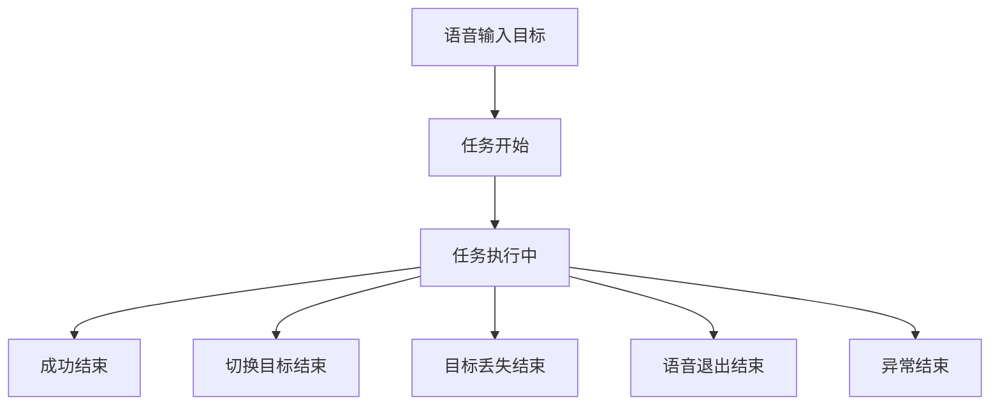

# 任务开始结束判定与执行期打点设计

本文档聚焦单次任务的生命周期划分，以及围绕 [核心帧处理函数](D:/cv_assist_project/core/system.py) 的执行期打点设计。整体性能统计总方案见 [单次任务性能统计分析方案](D:/cv_assist_project/perf_task_metrics_plan.md)。

## 1. 设计目标

本文档目标如下：

- 明确定义单次任务的开始条件与结束条件
- 给出任务完成的默认判定策略
- 明确任务执行阶段的核心埋点位置
- 定义任务执行过程中的关键性能指标
- 为后续实时展示与任务报告输出提供统一口径

## 2. 任务生命周期定义

单次任务定义为：用户围绕某个明确目标发起抓取意图后，系统针对该目标执行检测、引导、抓取确认直到结束的完整过程。

任务生命周期如下：

## 3. 任务开始条件

任务开始由用户语音输入触发，且语义上必须已经明确目标。

触发条件如下：

- 用户通过语音输入表达需要抓取的具体目标
- 用户通过语音输入表达切换到新的具体目标

开始时机建议定义为：

- 语音识别完成
- 目标解析完成
- 系统确认当前任务目标已更新

开始后应立即初始化以下内容：

- `task_id`
- `session_id`
- `task_type`
- `target_query`
- `start_time`
- 当前任务的帧级统计缓存
- 当前任务的完成判定状态缓存

如当前已存在进行中的任务，则原任务先结束，再启动新任务。

## 4. 任务结束条件

任务结束条件统一如下：

- `success`
- `switch_target`
- `lost_target`
- `user_voice_exit`
- `error`

各结束条件含义如下：

- `success`：任务执行完成，满足默认完成判定
- `switch_target`：用户通过语音切换到新目标，当前任务结束
- `lost_target`：连续多帧无法定位当前任务目标，当前任务结束
- `user_voice_exit`：用户通过语音要求退出程序，当前任务结束
- `error`：用户直接切断进程，或系统发生不可恢复异常，当前任务结束

语音反馈建议如下：

- 切换目标时：`已切换至 XX 目标`
- 目标丢失时：`无法定位 XX 目标`
- 语音退出时：`正在退出程序`

## 5. 任务完成默认判定

任务完成默认采用平衡完成判定，该策略兼顾鲁棒性与实际体验。

平衡完成判定规则如下：

- 先达到 `guidance.state == "ready"` 并连续稳定 `N` 帧
- 随后在限定时间窗口内检测到一次 `gesture == "closed"` 或 `state == "grabbed"`
- 满足后判定任务完成

该策略本质上是两阶段确认：

- 对齐完成
- 执行抓取动作

默认建议口径如下：

- `ready_to_grab == true` 连续大于等于 `grasp_stable_frames`
- 且后续 `1~2 秒` 内出现 `closed` 或 `grabbed`
- 则当前任务记为 `success`

该策略的优点如下：

- 比纯 `grabbed` 判定更稳
- 比只看 `ready` 更符合完成抓取任务的语义

该策略的代价如下：

- 需要维护额外任务状态
- 实现复杂度略高于单条件判断

## 6. 任务完成判定状态量

为了支撑默认完成判定，任务执行过程中建议维护以下状态量：

- `ready_streak`
- `ready_enter_ts`
- `ready_window_deadline_ts`
- `closed_after_ready_flag`
- `lost_target_streak`

各状态量的用途如下：

- `ready_streak`：记录连续多少帧处于 `ready` 或 `ready_to_grab`
- `ready_enter_ts`：记录第一次进入稳定 `ready` 的时间
- `ready_window_deadline_ts`：记录等待抓取动作确认的截止时间
- `closed_after_ready_flag`：记录是否在限定时间窗口内出现 `closed` 或 `grabbed`
- `lost_target_streak`：记录连续多少帧未检测到当前任务目标

## 7. 围绕核心函数的打点设计

任务执行阶段的核心埋点位置是 [核心帧处理函数](D:/cv_assist_project/core/system.py) 的 `process_frame()`。

选择该函数作为主打点位置的原因如下：

- 它覆盖了任务中的核心算法链路
- 它已经具备基础阶段耗时统计
- 它最适合输出单帧级的任务执行事实

围绕该函数的打点目标如下：

- 记录每帧处理链路的时间消耗
- 记录每帧任务状态是否推进
- 为任务聚合器提供完成判定依据

## 8. 执行期时间戳与阶段埋点

建议在 `process_frame()` 中补齐以下时间戳与阶段指标。

### 8.1 函数总入口与总出口

建议增加：

- `frame_start_ts`
- `frame_end_ts`

用途如下：

- 标识当前帧在任务中的处理起止时间
- 支撑完整任务时间轴分析

### 8.2 目标检测阶段

建议记录：

- `detection_start_ts`
- `detection_end_ts`
- `detection_time_ms`
- `detection_executed`

该阶段必须显式记录 `detection_executed`，因为当前检测存在跳帧复用机制。

### 8.3 手部检测阶段

建议记录：

- `hand_start_ts`
- `hand_end_ts`
- `hand_time_ms`

### 8.4 深度估计阶段

建议记录：

- `depth_start_ts`
- `depth_end_ts`
- `depth_time_ms`
- `depth_executed`

该阶段同样需要显式记录是否真正执行，以便区分跳帧缓存复用。

### 8.5 引导计算阶段

建议新增：

- `guidance_start_ts`
- `guidance_end_ts`
- `guidance_time_ms`

该阶段指标用于区分任务性能瓶颈到底来自检测、深度估计还是引导计算。

## 9. 任务状态埋点

除了时间指标，任务执行过程中还需要在每帧记录以下状态事实：

- `has_target`
- `has_hand`
- `has_guidance`
- `guidance_state`
- `ready_to_grab`
- `stable_ready_frames`
- `gesture`
- `target_visible`

此外，任务聚合器应记录以下关键事件首次发生时间：

- `first_target_detected_ts`
- `first_guidance_ts`
- `first_ready_ts`
- `first_grabbed_ts`

这些时间点主要用于任务推进分析，不要求每帧重复写入。

## 10. 单帧埋点数据结构

围绕 `process_frame()`，建议将每一帧抽象为一条结构化执行记录。单帧记录建议包含以下字段：

- `task_id`
- `frame_index`
- `frame_start_ts`
- `frame_end_ts`
- `process_time_ms`
- `detection_time_ms`
- `hand_time_ms`
- `depth_time_ms`
- `guidance_time_ms`
- `detection_executed`
- `depth_executed`
- `detections_count`
- `hands_count`
- `has_target`
- `has_hand`
- `has_guidance`
- `guidance_state`
- `ready_to_grab`
- `stable_ready_frames`
- `gesture`
- `target_visible`

该结构应作为任务聚合器的基础输入。

## 11. 任务执行阶段的性能衡量指标

围绕任务执行过程，建议从以下四组指标进行衡量。

## 11.1 时延指标

用于衡量任务执行效率：

- `avg_process_time_ms`
- `avg_detection_time_ms`
- `avg_hand_time_ms`
- `avg_depth_time_ms`
- `avg_guidance_time_ms`

## 11.2 稳定性指标

用于衡量任务执行是否平滑：

- `process_time_std`
- `slow_frame_count`
- `slow_frame_rate`
- `ready_state_interrupt_count`

## 11.3 任务推进指标

用于衡量任务推进过程是否顺利：

- `time_to_first_detection_ms`
- `time_to_first_guidance_ms`
- `time_to_first_ready_ms`
- `time_ready_to_closed_ms`
- `task_duration_sec`

## 11.4 可靠性指标

用于说明任务为何成功或失败：

- `target_detect_hit_rate`
- `guidance_generate_rate`
- `continuous_lost_target_max_frames`
- `lost_target_count`
- `completion_reason`
- `end_reason`

## 12. 任务期间终端实时输出

系统在任务执行期间需要将核心必要指标持续输出到终端，用于运行时观察与问题定位。

终端输出采用以下规则：

- 输出范围：仅在任务执行期间输出
- 输出频率：按 `1 秒` 时间窗口输出一次
- 输出方式：覆盖或追加均可，但建议保持单行摘要风格，避免刷屏
- 输出目标：当前终端与常规日志同时可见

终端实时输出建议聚焦以下核心指标：

- `task_id`
- `target_query`
- `task_state`
- `task_elapsed_sec`
- `voice_total_time_ms`
- `voice_asr_time_ms`
- `proc_fps_current`
- `proc_fps_avg`
- `e2e_fps_current`
- `e2e_fps_avg`
- `capture_time_avg_ms`
- `process_time_avg_ms`
- `detection_time_avg_ms`
- `depth_time_avg_ms`
- `guidance_time_avg_ms`
- `draw_time_avg_ms`
- `target_detect_hit_rate`
- `guidance_generate_rate`
- `lost_target_streak`

其中指标分组建议如下：

- 任务标识：`task_id`、`target_query`、`task_state`
- 语音链路：`voice_total_time_ms`、`voice_asr_time_ms`
- 实时吞吐：`proc_fps_current`、`e2e_fps_current`
- 窗口统计：`proc_fps_avg`、`e2e_fps_avg`
- 输入链路：`capture_time_avg_ms`
- 核心时延：`process_time_avg_ms`
- 关键阶段：`detection_time_avg_ms`、`depth_time_avg_ms`、`guidance_time_avg_ms`
- 输出链路：`draw_time_avg_ms`
- 稳定性与可靠性：`target_detect_hit_rate`、`guidance_generate_rate`、`lost_target_streak`

终端实时输出的主要目的如下：

- 让操作者在任务运行中立即感知性能波动
- 在目标丢失、抓取迟滞或卡顿时快速定位问题
- 为后续 JSON 报告提供运行期观测对照

## 13. 单次任务 JSON 报告输出

单次任务结束后，系统需要自动生成一份 JSON 格式总结报告，并写入指定目录统一归档。

报告输出要求如下：

- 输出时机：任务结束时立即输出
- 文件格式：`json`
- 存放目录：`D:/cv_assist_project/logs/task_metrics/`
- 目录策略：目录不存在时自动创建
- 文件命名：建议使用 `task_metrics_时间戳_task_id.json`

JSON 报告建议包含以下一级结构：

- `session_info`
- `task_info`
- `runtime_summary`
- `voice_summary`
- `latency_summary`
- `fps_summary`
- `quality_summary`
- `completion_summary`
- `error_summary`

各部分内容建议如下：

- `session_info`：会话标识、启动时间、运行环境基础信息
- `task_info`：`task_id`、`target_query`、`start_time`、`end_time`、`duration_sec`
- `runtime_summary`：任务期间帧数、有效帧数、统计窗口信息，以及 `capture_time_avg_ms`、`draw_time_avg_ms`
- `voice_summary`：`voice_total_time_ms`、`voice_asr_time_ms` 及语音链路相关统计
- `latency_summary`：处理总耗时与检测、手部、深度、引导的 `avg`、`max`
- `fps_summary`：`proc_fps` 与 `e2e_fps` 的当前值、平均值、最小值、最大值
- `quality_summary`：目标命中率、引导生成率、连续丢失最大帧数
- `completion_summary`：`completion_reason`、`end_reason`、`time_to_first_ready_ms`、`time_ready_to_closed_ms`
- `error_summary`：读帧失败次数、处理异常次数、异常结束原因

该 JSON 报告主要用于：

- 任务结束后的性能复盘
- 多次任务结果的横向整理与归档
- 后续离线统计分析或可视化

## 14. 目标丢失结束判定

`lost_target` 不应由单帧漏检触发，而应采用连续丢失判定。

建议规则如下：

- 当前任务目标连续 `M` 帧未检测到
- 且这段时间内未重新恢复检测
- 则判定为 `lost_target`

建议将 `M` 与时间窗口而不是固定帧数关联，使行为在不同 FPS 环境下保持一致。

## 15. 任务执行阶段的职责划分

任务执行阶段建议采用以下职责划分：

- `process_frame()`：输出帧级事实
- 任务聚合器：根据帧级事实判断任务是否推进与结束
- `run()`：处理语音切换、语音退出与异常结束等外部生命周期事件

这种划分可以保证：

- 任务开始与结束边界清晰
- 完成判定与性能统计解耦
- 后续实时展示与报告输出可以复用相同数据源

## 16. 结论

基于当前项目的引导状态、手势识别和帧级耗时能力，单次任务的生命周期已经可以稳定划分为：

- 语音明确目标后开始
- 任务执行中持续打点
- 按 `success`、`switch_target`、`lost_target`、`user_voice_exit`、`error` 结束

在实现层面，应以 [核心帧处理函数](D:/cv_assist_project/core/system.py) 为任务执行期的主打点位置，通过补充阶段时间戳、任务状态埋点和完成判定状态量，为终端实时指标输出和任务结束后的 JSON 报告提供统一基础。

我服从了documentation规范
