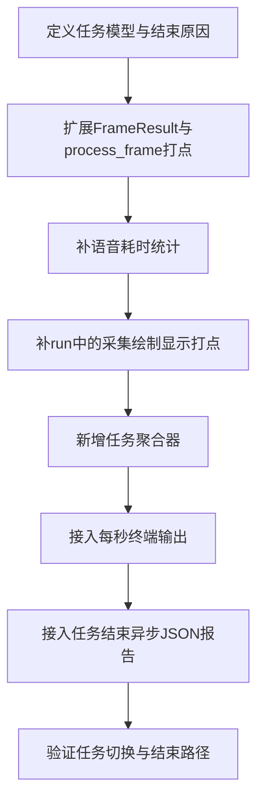

# 当前项目任务监测改造计划

## 1. 现状分析

结合文档 [D:/cv_assist_project/docs/task_lifecycle_and_metrics.md](D:/cv_assist_project/docs/task_lifecycle_and_metrics.md) 与现有代码，当前项目已经具备以下基础：

- 语音触发入口已存在：`_handle_voice_input()` 负责录音、ASR、目标解析，`_drain_voice_results()` 在主线程提交目标更新
- 主帧处理入口已存在：`process_frame()` 已输出 `total_time_ms`、`detection_time_ms`、`hand_time_ms`、`depth_time_ms`
- 主循环骨架已存在：`run()` 已覆盖采集、处理、绘制、显示和退出收尾
- 日志目录配置已存在：`config.py` / `config.yaml` 中已有 `logging.log_dir`
- 会话级 FPS 统计已存在：`fps_counter` 与 `e2e_fps_counter`

现有关键代码位置：

```353:361:D:/cv_assist_project/core/system.py
if status == 'ok' and result.get('target'):
    target = result['target']
    self.config.target_queries = [target]
    self.cached_detections = []
    self._reset_tts_context()
    logger.info(f"检测目标已更新为: {target}")
```

```384:451:D:/cv_assist_project/core/system.py
start = time.perf_counter()
...
return FrameResult(
    detections=detections,
    hands=hands,
    depth_map=depth_map,
    guidance=guidance_result,
    total_time_ms=total_time,
    detection_time_ms=det_time,
    hand_time_ms=hand_time,
    depth_time_ms=depth_time
)
```

```652:736:D:/cv_assist_project/core/system.py
ret, frame = cap.read()
...
result = self.process_frame(frame)
...
output = self.draw_results(frame, result)
...
loop_time_ms = (time.perf_counter() - loop_start) * 1000
self.e2e_fps_counter.update(frame_time_ms=loop_time_ms)
```

## 2. 当前缺口

现阶段项目距离你的需求还缺 4 个核心能力：

- 缺任务实体：当前只有“当前目标”，没有显式 `task_id`、`start_time`、`end_reason`、任务状态机
- 缺帧级结构化打点：`process_frame()` 只有部分耗时，没有任务状态字段、时间戳、跳帧执行标记
- 缺任务期聚合：没有围绕单个任务维护 `avg`、`std`、命中率、丢失计数、完成判定窗口
- 缺结果输出：没有“每 1 秒终端实时输出任务核心指标”与“任务结束写 JSON 报告到 `logs/task_metrics/`”

## 3. 改造目标

本次改造围绕文档要求落地以下结果：

- 任务开始：语音识别并解析出目标后创建新任务
- 任务结束：支持 `success`、`switch_target`、`lost_target`、`user_voice_exit`、`error`
- 任务执行期间：对 `process_frame()` 为主、`run()` 为辅进行分阶段打点
- 终端实时输出：任务期间每 1 秒输出一次核心监测指标
- JSON 报告：任务结束后异步写入 `D:/cv_assist_project/logs/task_metrics/`，不阻塞后续任务

## 4. 设计落点

### 4.1 任务生命周期管理

在 `core/system.py` 中新增任务运行时状态，建议不要把所有逻辑都塞进 `CVAssistSystem`，而是引入轻量任务对象/聚合器。

建议新增：

- 当前任务上下文：`current_task`
- 会话 ID：`session_id`
- 任务状态：`idle` / `running` / `finishing`
- 完成判定状态量：`ready_streak`、`ready_enter_ts`、`ready_window_deadline_ts`、`closed_after_ready_flag`、`lost_target_streak`

上述完成判定状态量含义如下：

- `ready_streak`：连续多少帧满足 `ready` 或 `ready_to_grab`，用于判断是否稳定进入可抓取阶段
- `ready_enter_ts`：正式进入稳定 `ready` 状态的时间点，用于作为抓取确认窗口的起点
- `ready_window_deadline_ts`：从 `ready_enter_ts` 开始计算的抓取确认截止时间，用于限定 `closed/grabbed` 的有效时间窗口
- `closed_after_ready_flag`：在 `ready` 窗口内是否已经检测到 `gesture == "closed"` 或 `guidance_state == "grabbed"`，用于判定任务成功
- `lost_target_streak`：连续多少帧未检测到当前任务目标，用于判定是否以 `lost_target` 结束任务

任务开始放在 `_drain_voice_results()` 中，因为这里是语音识别结果真正提交目标的地方。本次方案需要扩展当前语音关键词体系，在保留现有“找目标”模式的基础上，新增任务控制类关键词识别。任务结束在以下路径统一触发：

- 目标切换
- 语音退出
- 连续丢失目标
- 异常退出
- 平衡完成判定成功

### 4.2 帧级打点扩展

对 `process_frame()` 的返回结构进行扩展，使其从“单帧处理结果”升级为“单帧任务事实”。

建议扩展 `FrameResult`：

- 时间戳：`frame_start_ts`、`frame_end_ts`
- 阶段耗时：`guidance_time_ms`
- 执行标记：`detection_executed`、`depth_executed`
- 任务状态：`has_target`、`has_hand`、`has_guidance`、`guidance_state`、`ready_to_grab`、`stable_ready_frames`、`gesture`、`target_visible`
- 计数：`detections_count`、`hands_count`

同时在 `run()` 中补齐非 `process_frame()` 内的链路耗时：

- `capture_time_ms`：`cap.read()` 前后
- `draw_time_ms`：`draw_results()` 前后
- `display_time_ms`：`imshow + waitKey()` 前后
- 继续保留 `e2e_loop_time_ms`

为避免 FPS 统计口径混乱，建议明确职责边界如下：

- `draw_results()` 只负责渲染已有统计结果，不再负责更新 `fps_counter`
- `proc_fps` 统一在 `run()` 中基于 `process_time_ms` 或 `result.total_time_ms` 更新一次
- `e2e_fps` 统一在 `run()` 中基于 `loop_time_ms` 更新一次
- `TaskMetricsCollector` 只消费已经完成更新后的 FPS 快照或原始时间数据，不重复调用 `fps_counter.update()`

推荐收敛方案如下：

- 将当前 `draw_results()` 内部的 `self.fps_counter.update(...)` 迁移到 `run()` 主循环
- `run()` 在单帧处理完成后、绘制前后按固定顺序更新：
  - 先更新处理链路 FPS
  - 再更新端到端 FPS
  - 最后把当前 FPS 数值传给 `draw_results()` 用于显示
- `draw_results()` 接收的是“待显示的 FPS 值”，而不是自己计算或修改 FPS 状态

这样可以保证：

- FPS 只在一个地方更新一次
- 显示逻辑与统计逻辑解耦
- 终端输出、JSON 报告和画面 HUD 使用同一套 FPS 口径

### 4.3 语音链路打点

在 `_handle_voice_input()` 中拆出语音时间指标：

- `voice_total_time_ms`
- `voice_asr_time_ms`

如实现成本允许，可预留内部阶段：录音、ASR、解析，但第一期只需保证文档要求的两项落地。

语音结果提交时，建议把这些指标通过 `_voice_result_queue` 带回主线程，避免在线程间丢失统计信息。

语音链路需要从“仅提取目标名称”扩展为“识别语音动作 + 目标名称”的结果结构。

建议将语音线程回传给主线程的结果统一为“语音事件对象”，至少包含以下字段：

- `status`：结果状态，例如 `ok` / `error`
- `action`：语音动作类型，例如 `set_target` / `switch_target` / `user_voice_exit`
- `target`：当动作为目标设置或切换时返回目标名称
- `message`：用于日志和 TTS 播报的文本
- `raw_text`：ASR 原始识别文本，便于调试
- `voice_total_time_ms`
- `voice_asr_time_ms`

建议新增两类语音关键词解析能力：

- 目标类关键词：继续保留现有“找 / 找到 / 寻找 / 搜索 / 定位 / 在哪 / 哪里”及英文同类模式，用于提取目标物体
- 控制类关键词：新增“退出程序”“停止任务”等模式，用于生成任务控制动作

为解决“控制类动作与目标类提取优先级冲突”问题，解析策略建议固定为两阶段判定：

1. 先做控制类关键词判定
2. 只有未命中控制类动作时，才进入目标类提取

推荐实现规则如下：

- 先对 ASR 文本做标准化：去空白、转小写、去常见语气词
- 第一优先级匹配控制类关键词，例如：
  - `退出程序`
  - `停止任务`
  - `退出`
  - `停止`
- 一旦命中控制类关键词，直接返回：
  - `status = ok`
  - `action = user_voice_exit`
  - `target = None`
- 未命中控制类关键词时，再进入现有目标类解析：
  - LLM + Vision 提取目标
  - 回退到 `parse_command()` 关键词截取
- 若成功提取目标：
  - 当前无任务时返回 `action = set_target`
  - 当前已有任务时返回 `action = switch_target`
- 若控制类与目标类都未成功匹配：
  - 返回 `status = error`
  - 不触发任务状态变化

推荐增加一个统一解析接口，用于代替“只返回 target”的旧口径：

- `parse_voice_event(text, has_active_task, frames=None, llm_parser=None) -> dict`

本阶段明确约束如下：

- 现有目标提取模式继续保留，避免影响当前找物体体验
- 新增关键词识别应优先识别控制类动作，再识别目标类动作，避免“退出程序”被误当成目标名称
- 仅当成功识别出合法动作时，才触发任务开始、切换或退出

失败类语音结果统一采用以下口径：

- `status = error`
- `message`：错误提示文本
- 保留 `voice_total_time_ms` 与 `voice_asr_time_ms`
- 不结束当前任务，仅反馈错误信息

主线程 `_drain_voice_results()` 中的处理逻辑应据此重构为按 `action` 分流：

- `set_target`：更新目标、创建新任务、重置缓存和 TTS 上下文
- `switch_target`：先结束当前任务并冻结统计快照，再更新目标并启动新任务
- `user_voice_exit`：结束当前任务，写入 `end_reason = user_voice_exit`，随后通知主循环退出或停止当前任务
- `status = error`：只播报错误消息，不切换任务、不结束任务

### 4.4 任务聚合与结束判定

建议新增独立模块，例如 `[D:/cv_assist_project/utils/task_metrics.py](D:/cv_assist_project/utils/task_metrics.py)`，封装：

- 帧级事件接收
- 任务状态推进
- 平衡完成判定
- 每秒窗口统计
- 终端摘要生成
- JSON 报告生成与异步落盘

平衡完成判定应严格按文档实现：

- 当 `ready_to_grab == true` 持续达到 `grasp_stable_frames`，记录 `ready_enter_ts`
- 在 `1~2 秒` 窗口内若出现 `gesture == "closed"` 或 `guidance_state == "grabbed"`，则 `end_reason = success`
- 若连续多帧找不到当前目标，触发 `lost_target`

指标统计口径统一如下：

- `detection_time_avg_ms` 采用总帧平均口径，未执行检测的帧按 `0ms` 计入平均值
- `depth_time_avg_ms` 采用总帧平均口径，未执行深度估计的帧按 `0ms` 计入平均值
- 该口径用于表达检测与深度模块在整个任务期间对每帧平均带来的时间成本
- 第一阶段不单独输出“仅执行帧平均耗时”与“执行率”指标，避免口径复杂化

### 4.5 终端实时输出

在 `run()` 主循环内按 1 秒时间窗口触发终端摘要输出，不建议每帧输出。

建议输出以下字段：

- `task_id`
- `target_query`
- `task_state`
- `task_elapsed_sec`
- `voice_total_time_ms`
- `voice_asr_time_ms`
- `proc_fps_current`
- `proc_fps_avg`
- `e2e_fps_current`
- `e2e_fps_avg`
- `capture_time_avg_ms`
- `process_time_avg_ms`
- `detection_time_avg_ms`
- `depth_time_avg_ms`
- `guidance_time_avg_ms`
- `draw_time_avg_ms`
- `target_detect_hit_rate`
- `guidance_generate_rate`
- `lost_target_streak`

### 4.6 JSON 报告输出

在任务结束时生成 JSON 报告数据，并异步写入 `D:/cv_assist_project/logs/task_metrics/`。目录不存在则自动创建。

异步写入要求如下：

- 任务结束时立即完成内存态汇总与序列化准备
- 将写盘任务提交到单独的后台写入线程与 FIFO 队列
- 主循环无需等待写盘完成即可继续处理后续任务
- 新任务启动与执行不得依赖上一任务报告落盘完成
- 写入对象必须是已冻结的任务快照，禁止后台线程直接读取可变运行时状态
- 队列建议保持轻量有界，避免极端情况下无限堆积内存
- 写入失败时只做一次轻量重试；若仍失败，则记录错误日志与任务 ID，不阻塞后续任务
- 退出流程中仅做有限等待，用于消费剩余队列；超时后直接结束，不因报告落盘阻塞退出

推荐采用以下简化策略：

- 只保留一个报告写入线程，避免多线程同时写盘带来的竞争与复杂同步
- 每个任务结束时主线程只负责生成冻结后的 `report_dict` 与目标文件路径，然后立即入队
- 写入线程串行执行：创建目录、写入临时文件、原子替换为正式 JSON 文件
- 若写入失败，则在日志中记录失败文件路径、任务 ID、异常原因
- 不引入复杂的持久化重试队列，第一阶段以“轻量、可恢复、不阻塞”为优先

建议 JSON 一级结构：

- `session_info`
- `task_info`
- `runtime_summary`
- `voice_summary`
- `latency_summary`
- `fps_summary`
- `quality_summary`
- `completion_summary`
- `error_summary`

文件命名建议：

- `task_metrics_YYYYMMDD_HHMMSS_<task_id>.json`

### 4.7 推荐对象与接口设计

为降低 `core/system.py` 的复杂度，建议把“任务统计”和“报告写盘”拆成两个明确对象。

建议新增对象如下：

- `TaskMetricsCollector`
- `AsyncReportWriter`
- `TaskReportEnvelope`

#### `TaskMetricsCollector`

职责：

- 持有当前任务的运行态统计
- 接收每帧指标并更新聚合状态
- 执行 `success` / `lost_target` 等结束判定
- 在任务结束时生成冻结后的报告快照

建议核心方法：

- `start_task(task_id, target_query, start_time, session_id)`
- `record_voice_metrics(voice_total_time_ms, voice_asr_time_ms, raw_text)`
- `record_frame(frame_metrics)`
- `should_finish_task()`
- `finish_task(end_reason, end_time) -> report_dict`
- `build_terminal_summary(now) -> str`

关键约束：

- `finish_task()` 必须返回新构造的字典对象
- `finish_task()` 调用后，当前 collector 不再接受新帧写入
- `record_frame()` 只接受已经整理好的单帧事实，不在内部回头访问 `CVAssistSystem`

#### `AsyncReportWriter`

职责：

- 维护单写入线程与队列
- 串行消费任务报告快照
- 将报告安全写入磁盘
- 在退出时执行有限等待与收尾

建议核心方法：

- `start()`
- `enqueue(envelope)`
- `stop(timeout_sec)`
- `_writer_loop()`
- `_write_report(envelope)`

关键约束：

- `enqueue()` 只接收不可变快照对象
- `_writer_loop()` 只能消费队列，不允许读取主线程状态
- `stop(timeout_sec)` 只做有限等待，不阻塞主程序无限退出

#### `TaskReportEnvelope`

职责：

- 作为主线程与写入线程之间传递的最小写盘单元

建议字段：

- `task_id`
- `output_path`
- `report_dict`
- `created_at`
- `retry_count`

使用该对象的目的：

- 队列中只存放完整写盘快照
- 避免主线程把可变对象直接暴露给后台线程

### 4.8 推荐主线程调用时序

建议将“语音结果提交”“任务切换”“任务结束”“报告入队”统一成固定时序，避免竞态。以下时序同时覆盖任务快照冻结与异步写盘约束。

#### 新任务开始

1. 主线程从 `_voice_result_queue` 取到语音结果
2. 若 `status = ok` 且 `action = set_target`
3. 调用 `TaskMetricsCollector.start_task(...)`
4. 更新 `current_task`
5. 重置缓存、TTS 上下文和必要运行态

#### 任务切换

1. 主线程从 `_voice_result_queue` 取到语音结果
2. 若 `status = ok` 且 `action = switch_target`
3. 对旧任务调用 `finish_task(end_reason=\"switch_target\")`
4. 将返回的 `report_dict` 封装为 `TaskReportEnvelope`
5. 调用 `AsyncReportWriter.enqueue(...)`
6. 替换 `current_task`
7. 启动新任务并更新目标

#### 任务自然结束

1. 主线程在 `run()` 或任务聚合逻辑中判断任务已满足结束条件
2. 调用 `finish_task(end_reason=...)`
3. 将冻结后的报告快照入队
4. 清理当前任务上下文
5. 若需要，等待下一次语音触发新任务

#### 程序退出

1. 若存在活动任务，先调用 `finish_task(end_reason=\"error\" 或其它最终原因)`
2. 将报告快照入队
3. 调用 `AsyncReportWriter.stop(timeout_sec)`
4. 再释放摄像头、窗口等资源

统一约束如下：

- 队列中的每一项都应是完整快照，至少包含 `report_dict`、`task_id`、`output_path`
- `TaskMetricsCollector.finish_task()` 应返回新字典，而不是内部可变引用
- 主线程一旦完成入队，就可以安全重置或替换 `current_task`
- 后台线程只消费队列中的快照对象，不感知当前活跃任务是谁
- 禁止将 `current_task` 或聚合器实例本身直接传给后台线程
- 禁止后台线程在写盘时回头读取主线程中的运行时对象
- 禁止在新任务启动后继续复用旧任务的可变统计容器

### 4.9 推荐单帧指标对象

为了让 `process_frame()` 与 `TaskMetricsCollector` 解耦，建议引入轻量 `frame_metrics` 数据对象。

建议字段如下：

- `frame_index`
- `frame_start_ts`
- `frame_end_ts`
- `capture_time_ms`
- `process_time_ms`
- `draw_time_ms`
- `display_time_ms`
- `e2e_loop_time_ms`
- `detection_time_ms`
- `hand_time_ms`
- `depth_time_ms`
- `guidance_time_ms`
- `detections_count`
- `hands_count`
- `has_target`
- `has_hand`
- `has_guidance`
- `guidance_state`
- `ready_to_grab`
- `stable_ready_frames`
- `gesture`
- `target_visible`

推荐流转方式如下：

- `process_frame()` 负责产出算法相关字段
- `run()` 负责补齐采集、绘制、显示、端到端时间
- 然后统一整理为 `frame_metrics`
- 再传给 `TaskMetricsCollector.record_frame(frame_metrics)`

## 5. 涉及文件与改造内容

### [D:/cv_assist_project/core/system.py](D:/cv_assist_project/core/system.py)

主要改造文件，负责：

- 增加任务上下文初始化与切换
- 扩展 `FrameResult`
- 给 `process_frame()` 增加阶段打点与状态字段
- 在 `_handle_voice_input()` 中增加语音耗时统计
- 在 `_drain_voice_results()` 中触发任务开始/切换/退出
- 在 `run()` 中增加采集/绘制/显示耗时与每秒终端输出
- 在退出或任务结束时提交 JSON 报告异步写入

### [D:/cv_assist_project/utils/task_metrics.py](D:/cv_assist_project/utils/task_metrics.py)

建议新增，负责：

- 任务级统计聚合
- 结束判定状态维护
- 实时摘要格式化
- JSON 序列化
- JSON 异步写入调度

### [D:/cv_assist_project/config.py](D:/cv_assist_project/config.py)

扩展 `LoggingConfig`，建议新增：

- `enable_task_metrics: bool`
- `task_metrics_interval_sec: float`
- `task_metrics_dir: str`

### [D:/cv_assist_project/config.yaml](D:/cv_assist_project/config.yaml)

同步增加默认配置，例如：

- `enable_task_metrics: true`
- `task_metrics_interval_sec: 1.0`
- `task_metrics_dir: "logs/task_metrics"`

## 6. 实施顺序




建议按以下顺序实施：

- 第一步：定义任务上下文、`end_reason` 枚举与任务切换接口
- 第二步：扩展语音事件结构，统一 `status/action/target/message/voice_total_time_ms/voice_asr_time_ms`
- 第三步：扩展 `FrameResult` 与 `process_frame()` 打点
- 第四步：扩展 `audio/asr.py` 中的语音关键词解析，新增“退出程序”“停止任务”等控制类关键词识别
- 第五步：重构 `_drain_voice_results()`，按 `set_target/switch_target/user_voice_exit` 分流，并统一处理 `status = error`
- 第六步：在 `_handle_voice_input()` 中返回语音耗时指标
- 第七步：在 `run()` 中补 `capture/draw/display` 指标
- 第八步：实现 `TaskMetricsCollector`
- 第九步：接入每 1 秒终端输出
- 第十步：接入任务结束 JSON 报告异步写入
- 第十一步：验证 `success/switch_target/lost_target/user_voice_exit/error` 五条结束路径，以及新增退出/停止关键词识别

## 7. 验证重点

改造完成后，至少应验证以下场景：

- 语音设置新目标后能创建新任务并生成 `task_id`
- 再次语音切换目标时旧任务以 `switch_target` 正常收尾
- 语音说出“退出程序”“停止任务”等关键词时，当前任务以 `user_voice_exit` 结束
- 达到 `ready` 后在时间窗口内出现 `closed/grabbed`，任务以 `success` 结束
- 连续多帧丢失目标时任务以 `lost_target` 结束，并播报无法定位
- 程序异常或直接终止时任务以 `error` 结束
- 未命中目标类或控制类关键词，且无法解析出合法动作时，不进入新任务状态
- 任务期间终端每 1 秒输出摘要，不影响主循环明显卡顿
- 任务结束后 JSON 报告成功异步落到 `logs/task_metrics/`
- 连续切换多个任务时，上一任务报告写入不会阻塞下一任务执行

## 8. 风险与注意点

- `process_frame()` 当前没有独立的 `gesture` 输出字段，抓取完成判定依赖手势时，需要先确认手部检测结果中的 `gesture` 可稳定提取且语义一致

